# NarutoCode.ps1 設計書（SVN リビジョン範囲のコミット品質・傾向解析）

## 1. 目的 / ゴール
SVN のリモートリポジトリに対し、指定したリビジョン範囲 **rA〜rB** の履歴を取得し、
- **コミッター（author）単位**
- **ファイル単位**
で「コミット品質」「変更傾向」「協業・相互作用」を、**SVN コマンドで取得可能な情報のみ**（＋PowerShell での解析）で徹底分析し、
- CSV レポート（主要成果物）
- 必要に応じて PlantUML による可視化（任意成果物）
を出力する。

> 重要方針：
> - 外部静的解析（Sonar 等）が必須の指標は使わない。
> - なるべく「閾値超え」ではなく「行為の回数」「発生回数」「関係数」などの **カウント主体**で指標化する。
> - ただし UI/可視化や出力サイズの都合で「出力上限（Top N）」は許容（指標そのものの閾値判定とは別）。
>
> **数学的厳密性の原則：**
> 原理的に回避不能な場合を除き、数学的・論理的に厳密なロジックのみを採用する。
> ヒューリスティック（経験則に基づくフィルタリング・閾値判定）、省略（計算コスト削減を目的としたデータ切り捨て）、回避可能な誤差（丸め・近似式・概算）は一切許容しない。
> 性能上の制約がある場合は、精度を犠牲にせず、キャッシュ・並列化・アルゴリズム改善で対処する。

---

## 2. 非機能要件（制約）
- **PowerShell スクリプト 1 ファイル完結**（配布性・ポータビリティ）
- スクリプト名：`NarutoCode.ps1`
- 実行に必要な外部要件は **SVN CLI（svn.exe）** のみ
- リモート SVN に対して read-only（`svn log/diff/blame/info`）で完結
- 大規模範囲でも動くように
  - 取得回数と転送量を最小化
  - 中間結果のキャッシュ（同一ファイル・同一REVへの重複アクセス回避）
  - 可能なら並列化（RunspacePool）

---

## 3. 想定ユーザー操作（CLI 仕様）
### 3.1 代表的な使用例
```powershell
# 例: r1000〜r1200 の履歴を解析して ./out に出力
.\NarutoCode.ps1 -RepoUrl "https://svn.example.com/repos/project" -FromRev 1000 -ToRev 1200 -OutDirectory .\out
```

### 3.2 パラメータ設計

> **パラメータ名統一方針**
> 旧名（`-Path` / `-FromRevision` / `-ToRevision`）はエイリアスとして後方互換を維持。
> 短縮エイリアス（`-Pre`, `-Post`, `-Start`, `-End`, `-From`, `-To` 等）も引き続き使用可能。

- 必須
  - `-RepoUrl <string>`: SVN リモート URL（エイリアス: `-Path`）
  - `-FromRev <int>`: 開始リビジョン（含む）
  - `-ToRev <int>`: 終了リビジョン（含む）
- 任意（運用で効く）
  - `-SvnExecutable <string>`: svn コマンドのパス（既定: `svn`）
  - `-OutDirectory <string>`: 出力先（既定: `./NarutoCode_out`・固定名でキャッシュ再利用）
  - `-Username <string>` / `-Password <securestring>`: SVN 認証情報
  - `-NonInteractive`: `--non-interactive` を強制（CI 想定）
  - `-TrustServerCert`: `--trust-server-cert`（自己署名証明書対応）
  - `-Parallel <int>`: 最大並列数（既定: CPU コア数）
  - `-IncludePaths <string[]>` / `-ExcludePaths <string[]>`: 解析対象パスの絞り込み（ワイルドカード）
  - `-IncludeExtensions <string[]>` / `-ExcludeExtensions <string[]>`: 拡張子フィルタ
  - `-TopNCount <int>`: 可視化の出力上限（既定: 50・CSV は全件出力）
  - `-Encoding <string>`: 出力エンコーディング（既定: UTF-8）
  - `-IgnoreWhitespace`: diff 時に空白・改行コードの差異を無視
  - `-ExcludeCommentOnlyLines`: コメント専用行を全メトリクスで除外
  - `-NoProgress`: 進捗バー表示を抑止

---

## 4. 取得データ（SVN コマンド）
### 4.1 ログ（コミット一覧・メタ情報）
- コマンド：
  - `svn log --xml -v -r {FromRev}:{ToRev} {RepoUrl}`
- 取得内容（XML から抽出）
  - revision, author, date, msg
  - paths（path, action=A/M/D/R, copyfrom-path, copyfrom-rev）

### 4.2 差分（行数、変更箇所、内容）
- コマンド：
  - `svn diff -c {rev} {RepoUrl}`
- 取得内容（Unified diff から抽出）
  - ファイルごとの hunks（@@ -a,b +c,d @@）
  - `+` / `-` 行（ヘッダ `+++`, `---` は除外）
  - バイナリの場合の検出（`Cannot display: file marked as a binary type` 等）

> 行数（added/deleted）や hunk（同一箇所反復、往復）に使う。

### 4.3 生存量（ToRev 時点で残っている行の帰属）
- コマンド：
  - `svn blame -r {ToRev} --xml {RepoUrl}/{path}@{ToRev}`（※URL 形式）
  - あるいはワーキングコピー不要で `svn blame -r {ToRev} {fullUrl}`
- 取得内容
  - ToRev 時点の各行の「最終更新 revision」
  - （可能なら）`--xml` で安定パース

> 各 revision が **ToRev 時点で何行残したか（survivorship）** を算出。

### 4.4 補助情報（任意）
- `svn info --xml {RepoUrl}`: リポジトリルートの把握
- `svn diff --summarize -c {rev} {RepoUrl}`: 変更ファイル一覧だけ高速に欲しい場合

---

## 5. データモデル（内部表現）
PowerShell 内で扱う主要構造（擬似定義）。

### 5.1 Commit
- `Revision:int`
- `Author:string`
- `Date:DateTime`
- `Message:string`
- `ChangedPaths: PathChange[]`
- `FileDiffStats: hashtable[path -> DiffStat]`

### 5.2 PathChange
- `Path:string`（リポジトリルートからの相対を推奨）
- `Action:char`（A/M/D/R）
- `CopyFromPath:string?`
- `CopyFromRev:int?`

### 5.3 DiffStat（1 commit × 1 file）
- `AddedLines:int`
- `DeletedLines:int`
- `Hunks:Hunk[]`
- `IsBinary:bool`

### 5.4 Hunk
- `OldStart:int` `OldCount:int`
- `NewStart:int` `NewCount:int`
- `ContextHash:string`（後述：hunk 指紋）
- `AddedLineHashes:string[]`（内容 hash）
- `DeletedLineHashes:string[]`（内容 hash）

### 5.5 BlameSummary（ToRev 時点 × file）
- `LineCountTotal:int`
- `LineCountByRevision: hashtable[rev -> count]`

---

## 6. 解析パイプライン（処理手順）
### 6.1 全体フロー
1. **入力検証**
   - `FromRev <= ToRev` に正規化（逆の場合は swap）
   - RepoUrl 正規化（末尾スラッシュ調整など）
2. **ログ取得**（1回）
   - `svn log --xml -v -r A:B` を取得して Commit 配列に展開
3. **diff 取得 & パース**（revision 数だけ。ただしキャッシュ）
   - 各 revision に対して `svn diff -c rev` を取得
   - Unified diff をパースし、ファイル別に Added/Deleted/Hunk/バイナリを抽出
4. **時系列イベント構築**
   - `file -> [ (rev, author, date, DiffStat, hunks...) ]` のインデックスを構築
5. **（任意）ToRev blame 実行**
   - 範囲内で変更されたファイル集合に対し `svn blame -r ToRev` を実行
   - `rev -> surviveLines`（生存量）を得る
6. **メトリクス計算**
   - author 集計
   - file 集計
   - co-change（ファイル同時変更）集計
7. **CSV / PlantUML 出力**
   - `committers.csv` / `files.csv` / `commits.csv` / `couplings.csv` etc.
   - `.puml` / `.svg`（グラフ・ネットワーク）を常時出力

### 6.2 パフォーマンス方針
- `svn log` は 1 回で範囲全体を取得
- `svn diff -c` は revision 数回だが、
  - **並列**（RunspacePool、`-Parallel` で制御）
  - 取得結果を一時ファイルにキャッシュ（`$OutDir/cache/diff_r1234.txt`）
  - 同一 `-OutDirectory` での再実行時にキャッシュを自動再利用
- `svn blame` は **変更されたファイル集合**に限定
  - per-revision blame のキャッシュも `$OutDir/cache/blame/` に保存

---

## 7. 指標設計（コミッター単位）
> 「国際的に定評がある」寄りの概念（churn / ownership / change entropy / co-change / rework など）を、SVN だけで取れる形に落とす。

### 7.1 ベース指標（量・範囲・頻度）
| 指標 | 定義 | 取得方法 |
|---|---|---|
| コミット数 | 対象範囲のコミット数 | log から author で count |
| 活動日数 | コミットした日数（distinct date） | commit date の日付で distinct |
| 変更ファイル数 | 触ったユニークファイル数 | diff でファイル集合 |
| 変更ディレクトリ数 | 触ったユニークディレクトリ数 | path から親 dir 抽出 |
| 追加行数 / 削除行数 | 追加/削除行数合計（テキストのみ） | diff パース（+/- 行数） |
| 純増行数 | 追加行数 - 削除行数 | 算術 |
| 総チャーン | 追加行数 + 削除行数 | 算術 |
| Avg/Medianコミットチャーン | 1コミット当たり churn | per commit churn を統計 |
| バイナリ変更回数 | バイナリ変更ファイル数（合計） | diff バイナリ検出 |
| アクションA/M/D/R | A/M/D/R の回数 | log paths action 集計 |

### 7.2 チャーン比（要求：チャーン比）
**ChurnRatio** を複数形で出す（閾値判定せず数値そのものを提供）：
- `コミットあたりチャーン = 総チャーン / コミット数`
- `チャーン対純増比 = 総チャーン / max(1, abs(純増行数))`（net が小さいと増える傾向を可視化）
- `削除対追加比 = 削除行数 / max(1, 追加行数)`

### 7.3 自己相殺（要求：自己相殺）
**定義（カウント主体）**
- Author が追加した行（内容 hash）を、後続の commit で **同一 Author が削除**した回数（行数）

**取得方法（diff 内容ベース）**
1. 各 commit の diff から
   - added 行の `contentHash`（空白正規化した文字列の SHA1 など）
   - deleted 行の `contentHash`
2. author ごとに
   - `AddedHashSet[author]` に追加
   - 同 author の後続 commit で deletedHash が一致したら `自己相殺行数++`

**注意**
- 内容 hash だけだと偶然一致のリスクがあるため、可能なら `filePath + contentHash` でキー化。

### 7.4 同一箇所反復（要求：同一箇所反復）
**定義**
- 同一の「変更箇所（hunk）」を、同一 author が繰り返し編集した回数。

**hunk 指紋（ContextHash）の作り方（安定化）**
- diff の `@@ -a,b +c,d @@` は行番号が揺れるため、
  - hunk 内の **context 行**（先頭/末尾の数行）
  - `filePath` と併せて
  - 正規化してハッシュ化

例（擬似）：
- `anchor = filePath + "|" + first3Context + "|" + last3Context`
- `ContextHash = SHA1(anchor)`

**算出**
- `EditCountByAuthorHunk[author, file, ContextHash]++`
- コミッター指標としては
  - `同一箇所反復編集数 = Σ max(0, count-1)`（同一 hunk を2回以上触った「追加分」）
  - または `SameHunkEditEvents = Σ count`（単純回数）

### 7.5 反転・往復（要求：反転・往復）
「revert」「往復」を **diff の内容**と **hunk 時系列**で近似する。

**A) 反転（Self Revert / Cross Revert）**
- ある commit で追加した行 hash が、後続 commit で削除される
  - 同 author → 自己差戻行数（自己反転）
  - 別 author → 他者差戻行数（他者による反転）

**B) 往復（Ping-Pong）**
- 同一 hunk（ContextHash）に対し、author が **A→B→A** の順に編集イベントが発生した回数

算出（hunk 時系列）：
- `events = [(rev, author)]` を hunk ごとに並べ
- 3 連続ウィンドウで `a!=b && a==c` を検出 → `ピンポン回数++`

> 閾値不要（回数のみ）。

### 7.6 他人に修正された物量（要求：他人に修正された物量）
完全な「誰がどの行を改変したか」追跡は高コストになりがちなので、次の 2 系統で出す：

**(1) diff 追跡による「自分が追加→他人が削除」量**
- `AddedBy(author, file, hash)` を記録
- 後続 commit の deleted hash が一致し、削除者が別 author なら
  - `被他者削除行数(author)++`

**(2) blame による ToRev 時点の所有行（ownership）からの差分**
- `SurvivedLines(author)`（後述）を計測
- `AddedLines(author) - SurvivedLines(author)` を「生存しなかった追加」の近似
  - 誰が消したかは不明だが「他人に修正された/自分で消した」を含む
  - ここは補助指標として `消滅追加行数` として出す

### 7.7 ToRev まで生き残った物量 / 結局消えた物量（要求）
**(a) 生存行数（生存量）**
- 対象範囲の各 revision に対して、ToRev 時点で blame がその revision を指している行数をカウント
- author に紐付ける：`surviveLines(author) += surviveLines(rev)`

**(b) DeadLinesByToRev（結局消えた量）**
- `消滅追加行数 = max(0, 追加行数 - 生存行数)`

> blame を使うことで「ToRev まで残る」を実現（静的解析不要）。

### 7.8 変更の分散（Change Entropy / Distribution）
研究でよく使われる「変更がどれだけ散らばっているか」を、閾値なしで数値化。

**Commit Change Entropy（1コミット内）**
- 各 commit でファイルごとの churn `c_i = added_i + deleted_i`
- `p_i = c_i / Σ c_i`
- `Entropy = - Σ p_i * log2(p_i)`

**Author Change Entropy（範囲全体）**
- author の全 churn をファイル別に集計し同様に entropy。

> 値が高いほど「広く浅く触る」傾向。

### 7.9 協業指標（共同編集 / 所有権）
**File Co-Author Count（author 側）**
- author が触った各ファイルについて、そのファイルを触った distinct author 数を集め、
  - `平均共同作者数`
  - `最大共同作者数`

**Ownership（ToRev 時点）**
- blame から author が最終的に所有する行数（変更対象ファイル集合に限定）
  - `所有行数`
  - `所有割合 = OwnedLines / TotalLines`

> 「自分が最終的に面倒を見る領域がどれだけあるか」の傾向。

### 7.10 コミットメッセージ指標（ラベル化しない、回数化）
- `メッセージ文字数`（合計 / 平均）
- 正規表現カウント
  - `課題ID言及数`（例: `#123`, `PROJ-123` など）
  - `修正キーワード数`（fix/bug/hotfix 等）
  - `差戻キーワード数`（revert/backout 等）
  - `マージキーワード数`（merge 等。SVN では merge 記録がメッセージに出る場合がある）

> 「良い/悪い」の判定はせず、回数のみ提示。

---

## 8. 指標設計（ファイル単位）
### 8.1 ベース指標
| 指標 | 定義 | 取得方法 |
|---|---|---|
| コミット数 | 対象範囲内でそのファイルに変更があったコミット数 | diff で rev 集計 |
| 作者数 | 変更した distinct author 数 | commit×file から distinct |
| 追加行数/削除行数/チャーン/純増行数 | 行数系 | diff |
| バイナリ変更回数 | バイナリとして変更された回数 | diff |
| 作成回数/削除回数/置換回数 | A/D/R 回数 | log paths |
| 初回変更リビジョン / 最終変更リビジョン | 範囲内で最初/最後の変更 | 集計 |
| 平均変更間隔日数 | 変更間隔の平均（日） | commit date 差分 |

### 8.2 変更の集中（Ownership concentration / Knowledge）
**最多作者占有率（ToRev 時点 or 変更範囲内）**
- blame が使えるなら：ToRev 時点の所有行の author 別割合の最大値
- blame なしなら：範囲内の churn を author 別割合にして最大値

**AuthorsPerFile**
- distinct author 数

> Bus factor 的な判断はせず、数値を出す。

### 8.3 反復・往復・不安定さ（ファイル側）
- `同一箇所反復編集数 (合計)`（同一 hunk の edit 繰り返し総数）
- `ピンポン回数 (合計)`（hunk 単位の AB A 往復総数）
- `自己相殺行数 (合計)`（ファイル内で自己相殺された行数）
- `他者差戻行数 (合計)`（他者により反転された行数）

### 8.4 生存量（ファイル側）
- `生存行数 (範囲指定)`：ToRev blame で、範囲内 revision に属する行数合計
- `消滅追加行数 = max(0, 追加行数 - 生存行数 (範囲指定))`

### 8.5 ホットスポット（Hotspot）
外部の複雑度が無いので、
- **Volatility**（変更頻度）と
- **Churn**（変更量）
を組み合わせた「ホットスポット指数」を **ランキング用途の数値**として出す。

例：
- `ホットスポットスコア = コミット数² × 作者数 × 総チャーン ÷ max(活動期間日数, 1)`
- 併せて `ホットスポット順位` を出力（相対比較用）

> 閾値判定せず、単なるスコア・順位。

---

## 9. Co-change（ファイル同時変更）設計
「同じコミットで一緒に変わる」関係は欠陥・結合の匂い分析で定番。

### 9.1 集計
- 各 commit で `changedFiles = [f1,f2,...]`
- 全ペア (fi,fj) に対し
  - `CoChangeCount[fi,fj]++`

### 9.2 追加の関連度スコア（閾値なし数値）
- `Jaccard(fi,fj) = co / (count(fi)+count(fj)-co)`
- `Lift(fi,fj) = (co / CommitTotal) / ((count(fi)/CommitTotal)*(count(fj)/CommitTotal))`

### 9.3 出力
- `couplings.csv`
  - ファイルA, ファイルB, 共変更回数, Jaccard, リフト値

---

## 10. CSV 出力仕様

> 各 CSV の列は実装フェーズ（§18）に対応して段階的に追加される。
> Phase 1 で確定的指標の列を出力し、Phase 2 で推定的指標（行 hash 系）の列を追加する。

### 10.1 committers.csv（コミッター集計）

**Phase 1 で出力する列：**
- 作者
- コミット数
- 活動日数
- 変更ファイル数
- 変更ディレクトリ数
- 追加行数
- 削除行数
- 純増行数
- 総チャーン
- コミットあたりチャーン
- 削除対追加比
- チャーン対純増比
- バイナリ変更回数
- 追加アクション数 / 変更アクション数 / 削除アクション数 / 置換アクション数
- 生存行数（※NoBlame 時は空）
- 消滅追加行数（※NoBlame 時は空。算術: max(0, 追加行数 - 生存行数)）
- 所有行数（※NoBlame 時は空）
- 所有割合（※同上）
- 変更エントロピー
- 平均共同作者数
- 最大共同作者数
- メッセージ総文字数 / メッセージ平均文字数
- 課題ID言及数 / 修正キーワード数 / 差戻キーワード数 / マージキーワード数

**Phase 2 で追加する列：**
- 自己相殺行数
- 他者差戻行数
- 同一箇所反復編集数
- ピンポン回数

### 10.2 files.csv（ファイル集計）

**Phase 1 で出力する列：**
- ファイルパス
- コミット数
- 作者数
- 追加行数
- 削除行数
- 純増行数
- 総チャーン
- バイナリ変更回数
- 作成回数 / 削除回数 / 置換回数
- 初回変更リビジョン / 最終変更リビジョン
- 平均変更間隔日数
- 生存行数 (範囲指定)（※NoBlame 時は空）
- 消滅追加行数（※NoBlame 時は空）
- 最多作者チャーン占有率
- 最多作者blame占有率（※NoBlame 時は空）
- ホットスポットスコア
- ホットスポット順位

**Phase 2 で追加する列：**
- 同一箇所反復編集数 (合計)
- ピンポン回数 (合計)
- 自己相殺行数 (合計)
- 他者差戻行数 (合計)

### 10.3 commits.csv（生ログの整形：デバッグ＆他ツール連携用）
- リビジョン, 日時, 作者, メッセージ文字数, メッセージ (短縮), 変更ファイル数, 追加行数, 削除行数, チャーン, エントロピー

### 10.4 couplings.csv（共変更）
- ファイルA, ファイルB, 共変更回数, Jaccard, リフト値

---

## 11. PlantUML 出力（任意）
> PlantUML 自体は描画エンジンが必要だが、本ツールは **.puml を出すだけ**（外部連携不要）。

### 11.1 出力候補
1) `contributors_summary.puml`
- `@startuml` + `salt` テーブルで
  - 上位 N 人の主要指標（コミット数/チャーン/自己相殺行数/ピンポン回数/生存行数 等）

2) `hotspots.puml`
- 上位 N ファイル（ホットスポットスコア順）の表

3) `cochange_network.puml`
- 上位 N 結合（共変更回数 or Jaccard 上位）をネットワーク図
- ノード：ファイル
- エッジ：共変更（ラベルに count）

### 11.2 PlantUML 例（co-change network の骨子）

```plantuml
@startuml
left to right direction
skinparam linetype ortho

' Nodes
[FileA] as A
[FileB] as B

' Edges (top N)
A -- B : co=12\njacc=0.34

@enduml
```


---

## 12. 重要アルゴリズム詳細
### 12.1 Unified diff パーサ（要点）
- ファイル開始の検出
  - `Index:` / `---` / `+++` の組み合わせ、または `diff --git`（SVN の形式差がある）
- hunk 開始
  - `@@ -oldStart,oldCount +newStart,newCount @@` を正規表現で抽出
- 行の分類
  - `+` かつ `+++` でない → Added
  - `-` かつ `---` でない → Deleted
  - ` ` → Context
- バイナリ検出
  - 特定フレーズ一致で `IsBinary = $true`

**行内容 hash の正規化**
- 例：
  - 末尾空白除去
  - 連続空白の圧縮（オプション）
  - 文字コードは UTF-8 想定（SVN 出力を UTF-8 に寄せる）

### 12.2 hunk 指紋（ContextHash）
- hunk の context 行を収集
- 先頭 k 行 + 末尾 k 行（k=3 など）
- `filePath|firstK|lastK` を SHA1

> k は固定値だが閾値判定ではなく「指紋の安定化パラメータ」。

### 12.3 SelfCancel / CrossRevert（行 hash 追跡）
- `AddedBy[filePath, hash] = author`（最初の追加者）
- deleted が来たら
  - 追加者が同 author → SelfCancel++
  - 別 author → CrossRevert++（削除された側の author に対して RemovedByOthers++ も加算）

**注意**
- 同じ hash が何度も出る場合（同一行が複数行存在）、多重度が必要。
  - `AddedMultiset[filePath,hash]` をキュー/カウントで管理

### 12.4 Ping-Pong（hunk イベント時系列）
- `HunkEvents[filePath, ContextHash] = [(rev, author)]` を revision 昇順に
- 3 連続の author で `A,B,A` をカウント

### 12.5 Survivorship（ToRev blame 集計）
- file ごとに ToRev で `svn blame --xml` を取得
- 各行の `revision` を読む（=その行の最終変更 revision）
- `LineCountByRevision[rev]++`
- 範囲内 rev のみ合算

rev→author は log から引ける：
- `RevToAuthor[rev] = author`

---

## 13. エッジケースと扱い
- **リネーム/移動（R + copyfrom）**
  - log の `copyfrom-path` を記録
  - file 指標は基本「最終パス」で集計しつつ、必要なら `OriginalPath` を別列で出す
- **削除（D）**
  - diff が取れない場合がある
  - 可能なら削除直前の状態への diff で行数を推定するが高コストなので、
    - `DeleteCount++` としてイベントのみ記録
- **バイナリ**
  - lines churn を 0 とし、`BinaryChangeCount` を別に持つ
- **巨大 diff**
  - diff パースはストリーミング（行単位）
  - 途中でメモリを食わないように hunk の full text は保持しない（hash のみ）
- **作者名の欠落**
  - `author` が無い場合は `"(unknown)"` にまとめる

---

## 14. 実装構成（NarutoCode.ps1 内のモジュール分割イメージ）
1ファイル内で関数群として分割する。

### 14.1 主要関数（案）
- `Invoke-Svn($args, [switch]$AllowFail)`
- `Get-SvnLogXml($repoUrl, $fromRev, $toRev)`
- `Parse-SvnLogXml($xmlText)` -> Commit[]
- `Get-SvnDiffText($repoUrl, $rev)`（キャッシュ込み）
- `Parse-SvnUnifiedDiff($diffText)` -> hashtable[path->DiffStat]
- `Get-SvnBlameSummary($fullUrl, $toRev)` -> BlameSummary
- `Compute-Metrics($commits, $diffIndex, $blameIndex)` -> objects
- `Export-CsvReports($outDir, ...)`
- `Export-PlantUml($outDir, ...)`

### 14.2 並列実行（PS 5.1 互換の方針）
- RunspacePool を自前で作る
- diff/ blame のような I/O 多い箇所を並列化
- 共有辞書への書き込みはロック（.NET ConcurrentDictionary or lock）

---

## 15. テスト戦略

### 15.1 基本方針
- **SVN 不要でテスト可能** にすることを最優先とする
- モック SVN 出力（XML / Unified diff テキスト）をテストデータとして用意し、パース関数・集計関数を単体テストする
- テストフレームワークは **Pester 5.x** を使用
- テストファイルは `tests/` フォルダに配置し、機能領域ごとに分割可能

### 15.2 テスト層の分類

| 層 | 対象 | テスト方法 | SVN 必要 |
|---|---|---|---|
| L1: パース | XML パーサ / diff パーサ / blame パーサ | モック文字列を入力 → 構造体を検証 | 不要 |
| L2: 集計 | メトリクス計算関数 | パース済みデータ構造を入力 → 指標値を検証 | 不要 |
| L3: 出力 | CSV / JSON / PlantUML 生成 | 集計済みデータを入力 → 出力内容を検証 | 不要 |
| L4: 結合 | エンドツーエンド（小規模SVNリポジトリ） | 実際の svn コマンド → 出力ファイル検証 | 必要 |

> L1〜L3 を CI で常時実行し、L4 は手動 or SVN が利用可能な環境でのみ実行する。

### 15.3 モック SVN 出力の設計

#### 15.3.1 モック svn log XML
以下のシナリオをカバーするテストデータを用意する：

```xml
<?xml version="1.0" encoding="UTF-8"?>
<log>
  <!-- 通常コミット -->
  <logentry revision="100">
    <author>alice</author>
    <date>2025-01-10T09:00:00.000000Z</date>
    <paths>
      <path action="M">/trunk/src/Main.cs</path>
      <path action="A">/trunk/src/Helper.cs</path>
    </paths>
    <msg>feat: add helper class (#42)</msg>
  </logentry>
  <!-- 同日の2コミット目 (ActiveDays 検証) -->
  <logentry revision="101">
    <author>alice</author>
    <date>2025-01-10T14:00:00.000000Z</date>
    <paths>
      <path action="M">/trunk/src/Main.cs</path>
    </paths>
    <msg>fix: null check</msg>
  </logentry>
  <!-- 別 author -->
  <logentry revision="102">
    <author>bob</author>
    <date>2025-01-11T10:00:00.000000Z</date>
    <paths>
      <path action="M">/trunk/src/Main.cs</path>
      <path action="M">/trunk/src/Helper.cs</path>
    </paths>
    <msg>refactor: rename variables</msg>
  </logentry>
  <!-- リネーム -->
  <logentry revision="103">
    <author>alice</author>
    <date>2025-01-12T08:00:00.000000Z</date>
    <paths>
      <path action="D">/trunk/src/Helper.cs</path>
      <path action="A" copyfrom-path="/trunk/src/Helper.cs" copyfrom-rev="102">/trunk/src/Util.cs</path>
    </paths>
    <msg>refactor: rename Helper to Util</msg>
  </logentry>
  <!-- author 欠落 -->
  <logentry revision="104">
    <date>2025-01-13T12:00:00.000000Z</date>
    <paths>
      <path action="M">/trunk/src/Main.cs</path>
    </paths>
    <msg>merge from branch</msg>
  </logentry>
  <!-- バイナリ変更 -->
  <logentry revision="105">
    <author>bob</author>
    <date>2025-01-14T09:00:00.000000Z</date>
    <paths>
      <path action="M">/trunk/docs/logo.png</path>
      <path action="M">/trunk/src/Main.cs</path>
    </paths>
    <msg>docs: update logo</msg>
  </logentry>
</log>
```

#### 15.3.2 モック svn diff 出力
各 revision に対応する Unified diff テキスト：

```diff
--- r100 の diff ---
Index: trunk/src/Main.cs
===================================================================
--- trunk/src/Main.cs	(revision 99)
+++ trunk/src/Main.cs	(revision 100)
@@ -10,3 +10,5 @@
     // existing code
+    var helper = new Helper();
+    helper.Run();

Index: trunk/src/Helper.cs
===================================================================
--- trunk/src/Helper.cs	(nonexistent)
+++ trunk/src/Helper.cs	(revision 100)
@@ -0,0 +1,15 @@
+public class Helper
+{
+    public void Run()
+    {
+        // do something
+    }
+}
(... 計 15 行追加)

--- r101 の diff ---
Index: trunk/src/Main.cs
===================================================================
--- trunk/src/Main.cs	(revision 100)
+++ trunk/src/Main.cs	(revision 101)
@@ -10,5 +10,6 @@
     // existing code
     var helper = new Helper();
+    if (helper == null) return;
     helper.Run();

--- r105 の diff (バイナリ含む) ---
Index: trunk/docs/logo.png
===================================================================
Cannot display: file marked as a binary type.
svn:mime-type = image/png

Index: trunk/src/Main.cs
===================================================================
--- trunk/src/Main.cs	(revision 104)
+++ trunk/src/Main.cs	(revision 105)
@@ -1,3 +1,4 @@
+using System.Drawing;
 // main file
```

#### 15.3.3 モック svn blame XML

```xml
<?xml version="1.0" encoding="UTF-8"?>
<blame>
  <target path="trunk/src/Main.cs">
    <entry line-number="1"><commit revision="105"><author>bob</author></commit></entry>
    <entry line-number="2"><commit revision="100"><author>alice</author></commit></entry>
    <entry line-number="3"><commit revision="100"><author>alice</author></commit></entry>
    <entry line-number="4"><commit revision="101"><author>alice</author></commit></entry>
    <entry line-number="5"><commit revision="100"><author>alice</author></commit></entry>
    <!-- ... 以下省略 -->
  </target>
</blame>
```

### 15.4 テストケース設計（Phase 1 対応）

#### L1: パーステスト
| テスト名 | 入力 | 期待結果 |
|---|---|---|
| Log XML: 通常パース | モック XML (6 entries) | Commit 配列 6 件、各フィールド一致 |
| Log XML: author 欠落 | revision 104 | author = "(unknown)" |
| Log XML: copyfrom 付き | revision 103 | PathChange に CopyFromPath/Rev が設定 |
| Log XML: 前方ゴミ付き | 警告行 + XML | パース成功 |
| Diff: 行数カウント | r100 のモック diff | Main.cs: +2, Helper.cs: +15 |
| Diff: バイナリ検出 | r105 のモック diff | logo.png: IsBinary=true, 行数=0 |
| Diff: hunk ヘッダ抽出 | @@ 行 | OldStart/OldCount/NewStart/NewCount 一致 |
| Blame XML: 行数集計 | モック blame XML | rev 別行数が正しい |

#### L2: 集計テスト
| テスト名 | 入力 | 期待結果 |
|---|---|---|
| コミット数 by author | 6 commits | alice=3, bob=2, (unknown)=1 |
| 活動日数 | alice の 3 commit | 3日（1/10, 1/12, 1/13 ではなく 1/10, 1/12 = 2日） |
| 変更ファイル数 | alice の全 commit | distinct ファイル集合のサイズ |
| コミットあたりチャーン | 総チャーン / コミット数 | 算術結果一致 |
| 変更エントロピー | 2ファイル churn (10, 10) | エントロピー = 1.0 |
| 変更エントロピー | 1ファイルのみ | エントロピー = 0.0 |
| Co-change | r102 で Main.cs + Helper.cs | 共変更回数 = 1, Jaccard 計算一致 |
| ホットスポットスコア | コミット数 × チャーン | 算術結果一致 |
| 所有行数 (blame) | モック blame | alice: 4行, bob: 1行 |
| メッセージキーワードカウント | "feat: ... (#42)" | 課題ID言及数=1 |
| メッセージキーワードカウント | "fix: null check" | 修正キーワード数=1 |

#### L3: 出力テスト
| テスト名 | 入力 | 期待結果 |
|---|---|---|
| CSV ヘッダ | committers 集計データ | Phase 1 の全列が存在 |
| CSV 行数 | 3 author | ヘッダ + 3 行 |
| JSON 構造 | 実行メタ + 集計 | Summary / Details キーが存在 |
| run_meta.json | 実行パラメータ | RepoUrl, FromRev, ToRev 等が記録 |
| PlantUML | 上位ファイル | `@startuml` 〜 `@enduml` で囲まれる |

### 15.5 テストケース設計（Phase 2 対応）

#### 追加 L2 テスト（行 hash 系）
| テスト名 | 入力 | 期待結果 |
|---|---|---|
| 自己相殺 | alice が r100 で追加した行を r101 で削除 | 自己相殺行数 >= 1 |
| 他者差戻 | alice 追加 → bob 削除 | 他者差戻行数 >= 1 |
| ピンポン | hunk events: alice→bob→alice | ピンポン回数 >= 1 |
| 同一箇所反復編集 | 同一 ContextHash に 3 回 edit | 同一箇所反復編集数 = 2 |
| 偽陽性制御 | `}` のみの行が複数ファイルに存在 | ファイルが異なれば別カウント |

### 15.6 テスト実装パターン（Pester 5.x）

```powershell
# モック SVN 出力を使ったパーステストの例
Describe 'Parse-SvnLogXml' {
    BeforeAll {
        # モック XML をテストデータとして準備
        $script:MockLogXml = @'
<?xml version="1.0" encoding="UTF-8"?>
<log>
  <logentry revision="100">
    <author>alice</author>
    <date>2025-01-10T09:00:00.000000Z</date>
    <paths>
      <path action="M">/trunk/src/Main.cs</path>
      <path action="A">/trunk/src/Helper.cs</path>
    </paths>
    <msg>feat: add helper</msg>
  </logentry>
</log>
'@
    }

    It 'コミット1件をパースできる' {
        $commits = Parse-SvnLogXml -XmlText $script:MockLogXml
        $commits.Count | Should -Be 1
        $commits[0].Revision | Should -Be 100
        $commits[0].Author | Should -Be 'alice'
    }

    It '変更パスを正しく抽出する' {
        $commits = Parse-SvnLogXml -XmlText $script:MockLogXml
        $commits[0].ChangedPaths.Count | Should -Be 2
        $commits[0].ChangedPaths[0].Action | Should -Be 'M'
        $commits[0].ChangedPaths[1].Action | Should -Be 'A'
    }
}

# モック diff テキストを使った行数カウントテストの例
Describe 'Parse-SvnUnifiedDiff' {
    It 'ファイル別の追加/削除行数を正しくカウントする' {
        $diffText = @'
Index: trunk/src/Main.cs
===================================================================
--- trunk/src/Main.cs	(revision 99)
+++ trunk/src/Main.cs	(revision 100)
@@ -10,3 +10,5 @@
     // existing code
+    var helper = new Helper();
+    helper.Run();
'@
        $result = Parse-SvnUnifiedDiff -DiffText $diffText
        $result['trunk/src/Main.cs'].AddedLines | Should -Be 2
        $result['trunk/src/Main.cs'].DeletedLines | Should -Be 0
    }
}
```

### 15.7 結合テスト（L4: SVN 環境必須）
- 小規模な SVN リポジトリ（10 コミット程度）を `svnadmin create` + `svn import` で構築
- スクリプトをエンドツーエンドで実行し、出力 CSV の件数・値を検証
- CI 環境で SVN が利用可能な場合のみ実行（`-Tag Integration` で制御）
- ローカル実行時は `file:///` スキームでテスト可能

---

## 16. 出力物一覧（最終成果物）
- `committers.csv`
- `files.csv`
- `commits.csv`
- `couplings.csv`
- `kill_matrix.csv`
- `run_meta.json`（実行条件、svn バージョン、開始/終了時刻などのメタ）
- `contributors_summary.puml`
- `hotspots.puml`
- `cochange_network.puml`
- `file_hotspot.svg`
- `file_quality_scatter.svg`
- `committer_outcome_combined.svg`
- `committer_outcome_*.svg`
- `committer_scatter_combined.svg`
- `committer_scatter_*.svg`
- `team_survived_share.svg`
- `team_interaction_heatmap.svg`
- `team_activity_profile.svg`
- `commit_timeline.svg`
- `commit_scatter.svg`
- `cache/`（`diff` / `blame` / `cat` キャッシュ）

`-TopNCount` は可視化出力の表示件数だけを制御し、CSV は常に全件を出力する。

---

## 17. 今後の拡張余地（静的解析なしでできる強化）
- **パスフィルタの高度化**：branches/tags を除外して trunk のみなど
- **コミットのバッチ取得**：`svn diff -r rev-1:rev` と比較し、-c が遅いサーバで最適化
- **ファイル種別分析**：拡張子別 churn / author など
- **変更タイプ分類**（回数のみ）
  - whitespace only 変更（`svn diff -x -w` と比較することで近似）
  - rename/move の頻度
- **共変更の author 別**：誰がどの coupling をよく発生させるか

---

## 18. 実装フェーズ定義

### 18.1 フェーズ分割の基本方針

| フェーズ | テーマ | 判断基準 |
|---|---|---|
| **Phase 1** | 確定的指標 | SVN 出力から一意に定まる数値。偽陽性・偽陰性が原理的に発生しない指標 |
| **Phase 2** | 推定的指標 | 行内容 hash や hunk 指紋に基づく推定。偶然一致による偽陽性リスクがある指標 |

**Phase 1 に含まれるもの（確定的）：**
- 行数（added / deleted / net / churn）— diff の `+` / `-` を数えるだけ
- コミット数・日数・ファイル数・ディレクトリ数 — log から一意に算出
- A/M/D/R アクション数 — log の action 属性
- チャーン比（算術演算のみ）
- Change Entropy（確率分布の情報量、入力は確定的な churn 値）
- Co-change カウント・Jaccard・Lift（同一コミット内のファイル集合から一意に決まる）
- コミットメッセージ指標（正規表現マッチの回数）
- Blame 由来の生存量・所有権（`svn blame` の出力は確定的）
- 消滅追加行数（= max(0, 追加行数 − 生存行数)、算術のみ）
- ホットスポットスコア（コミット数 × チャーン、算術のみ）

**Phase 2 に含まれるもの（推定的）：**
- 自己相殺行数 — 行内容 hash の一致に依存（`}` 等の頻出行で偽陽性）
- 他者差戻行数 — 同上
- 同一箇所反復編集数 — hunk 指紋（ContextHash）の安定性に依存
- ピンポン回数 — hunk 指紋 + 時系列の組み合わせ

---

### 18.2 Phase 1: 確定的指標の実装（全 9 ステップ）

#### Step 1-1: 基盤整備・パラメータ統一
- **パラメータ改名**
  - `-Path` → `-RepoUrl`（エイリアスとして `-Path` を残す）
  - `-FromRevision` → `-FromRev`（既存エイリアス維持）
  - `-ToRevision` → `-ToRev`（既存エイリアス維持）
- **新規パラメータの追加**
  - `-OutDirectory`, `-Username`, `-Password`, `-NonInteractive`, `-TrustServerCert`
  - `-Parallel`, `-IncludePaths`, `-ExcludePaths`, `-IncludeExtensions`, `-ExcludeExtensions`
  - `-TopNCount`, `-Encoding`, `-IgnoreWhitespace`, `-ExcludeCommentOnlyLines`, `-NoProgress`

> **注:** 以下のパラメータは削除済み（機能は常時有効化）:
> - `-NoBlame`（blame は常時実行）
> - `-EmitPlantUml`（PlantUML / SVG は常時出力）
> - `-StrictMode`（Strict モードは常時有効）
> - `-DeadDetailLevel`（常に最大値 2）
- **出力ディレクトリ・キャッシュ基盤**
  - `$OutDirectory` のデフォルト値（`./NarutoCode_out`）
  - `$OutDirectory/cache/` ディレクトリの自動作成
- **`run_meta.json` の出力**
  - 実行条件（パラメータ値、svn バージョン、開始/終了時刻）を記録
- **完了条件**: 新パラメータで起動でき、OutDir と run_meta.json が生成される

#### Step 1-2: ログ解析の拡充
- **Commit データモデルの実装**
  - `Parse-SvnLogXml` 関数: XML → Commit[] 変換
  - Commit / PathChange の PSCustomObject 構造
- **PathChange の完全解析**
  - A/M/D/R アクションの保存
  - `copyfrom-path` / `copyfrom-rev` の抽出
- **author 欠落時の `(unknown)` 処理**
- **完了条件**: モック XML に対するパーステストが全通過

#### Step 1-3: Diff パースの高度化
- **`Parse-SvnUnifiedDiff` 関数の実装**
  - 入力: diff テキスト全体
  - 出力: `hashtable[path -> DiffStat]`
  - DiffStat: AddedLines, DeletedLines, Hunks（行番号のみ）, IsBinary
- **hunk ヘッダのパース**（行番号のみ。Phase 2 の ContextHash は含まない）
  - `@@ -oldStart,oldCount +newStart,newCount @@`
- **バイナリ検出の強化**
  - `Cannot display: file marked as a binary type.`
  - `Binary files ... differ`
- **ストリーミングパース対応**
  - `Measure-SvnDiffStreaming`（既存）との統合 or 置き換え
- **完了条件**: モック diff テキストに対するパーステストが全通過

#### Step 1-4: diff キャッシュと並列取得
- **diff 結果のファイルキャッシュ**
  - `$OutDir/cache/diff_r{rev}.txt` に保存
  - 再実行時はキャッシュから読み込み
- **RunspacePool による並列取得**
  - `-Parallel` パラメータで最大並列数を制御
  - ConcurrentDictionary で結果を集約
- **完了条件**: キャッシュが生成・再利用される。並列取得で結果が直列と一致する

#### Step 1-5: コミッター単位メトリクス計算
- **ベース指標（§7.1）**: コミット数, 活動日数, 変更ファイル数, 変更ディレクトリ数,
  追加行数, 削除行数, 純増行数, 総チャーン, Avg/Medianコミットチャーン,
  バイナリ変更回数, ActionsA/M/D/R
- **チャーン比（§7.2）**: コミットあたりチャーン, チャーン対純増比, 削除対追加比
- **Change Entropy（§7.8）**: 変更エントロピー
- **協業指標（§7.9、blame 不要部分）**: 平均共同作者数, 最大共同作者数
- **メッセージ指標（§7.10）**: メッセージ総文字数, メッセージ平均文字数,
  課題ID言及数, 修正キーワード数, 差戻キーワード数, マージキーワード数
- **完了条件**: モックデータに対する集計テストで全指標の値が期待通り

#### Step 1-6: ファイル単位メトリクス計算
- **ベース指標（§8.1）**: コミット数, 作者数, 追加行数/削除行数/チャーン/純増行数,
  バイナリ変更回数, 作成回数/削除回数/置換回数, 初回変更リビジョン, 最終変更リビジョン,
  平均変更間隔日数
- **最多作者チャーン占有率（§8.2、blame 不要版）**
- **ホットスポット（§8.5）**: ホットスポットスコア, ホットスポット順位
- **完了条件**: モックデータに対する集計テストで全指標の値が期待通り

#### Step 1-7: Blame 解析（生存量・所有権）
- **`Get-SvnBlameSummary` 関数の実装**
  - `svn blame --xml -r {ToRev} {fullUrl}` の取得・パース
  - `BlameSummary` 構造: LineCountTotal, LineCountByRevision
- **生存量（§7.7a）**: 生存行数（author 紐付け）
- **消滅量（§7.7b）**: 消滅追加行数 = max(0, 追加行数 − 生存行数)
- **所有権（§7.9）**: 所有行数, 所有割合
- **最多作者blame占有率（§8.2、blame 版）**
- ~~**`-NoBlame` 指定時のスキップ処理**~~ 削除済み（blame は常時実行）
- **blame の並列取得**（Step 1-4 の RunspacePool を再利用）
- **完了条件**: モック blame XML に対するテスト通過。NoBlame 時に該当列が空

#### Step 1-8: Co-change 解析
- **ペア集計（§9.1）**: commit ごとの変更ファイルからペアを列挙（ファイル数によるフィルタリングなし）
- **Jaccard / リフト値（§9.2）** の算出
- **`-TopNCount` による出力上限**
- **完了条件**: 3ファイル × 3コミットのモックデータで 共変更回数/Jaccard/リフト値 が正しい

#### Step 1-9: 出力（CSV / PlantUML / run_meta.json）
- **CSV 出力**
  - `committers.csv`（Phase 1 列）
  - `files.csv`（Phase 1 列）
  - `commits.csv`
  - `couplings.csv`
- **PlantUML / SVG 出力**（常時出力）
  - `contributors_summary.puml`
  - `hotspots.puml`
  - `cochange_network.puml`
- **`run_meta.json`** の内容充実
- **完了条件**: 出力ファイルが生成され、ヘッダ・行数・値が期待通り

---

### 18.3 Phase 2: 推定的指標の実装（全 4 ステップ）

> Phase 2 は Phase 1 完了後に着手する。
> 行内容 hash と hunk 指紋に基づく推定指標を追加する。

#### Step 2-1: 行内容 hash 基盤
- **行内容の正規化ルール**（§12.1）
  - 末尾空白除去、連続空白の圧縮
  - `filePath + normalizedContent` で SHA1 hash
- **偽陽性緩和策**
  - 短すぎる行（空行、`{`, `}`, `return;` 等）の除外オプション
  - `filePath` をキーに含めることで異なるファイル間の偶然一致を防止
- **`AddedMultiset[filePath, hash]`** のキュー管理（同一行の多重度対応）
- **完了条件**: hash 生成のユニットテスト通過。偽陽性テストケースで誤カウントが発生しない

#### Step 2-2: SelfCancel / CrossRevert / RemovedByOthers
- **SelfCancel（§7.3）**: 自分が追加 → 自分が削除
- **SelfRevert / CrossRevert（§7.5A）**: 追加行 hash が後続で削除される
- **被他者削除行数（§7.6(1)）**: 自分が追加 → 他人が削除
- **ファイル側**: 自己相殺行数 (合計), 他者差戻行数 (合計)
- **完了条件**: 「alice 追加 → alice 削除」「alice 追加 → bob 削除」のモックデータで正しくカウント

#### Step 2-3: hunk 指紋と反復・往復
- **ContextHash の実装（§12.2）**
  - hunk の context 行から `filePath|firstK|lastK` で SHA1
- **同一箇所反復編集数（§7.4）**
  - `EditCountByAuthorHunk[author, file, ContextHash]` の集計
- **ピンポン回数（§7.5B, §12.4）**
  - hunk イベント時系列から A→B→A パターンの検出
- **完了条件**: 3 コミットのモックデータで 同一箇所反復編集数 と ピンポン回数 が正しくカウント

#### Step 2-4: DeadBySelf / DeadByOthers の内訳化
- 削除済み（自己消滅行数・被他者消滅行数は自己相殺行数・他者差戻行数にそれぞれ統合）

---

### 18.4 フェーズ間の依存関係図

```
Phase 1
├── Step 1-1: 基盤整備 ─────────────────────────────────┐
├── Step 1-2: ログ解析 ──┐                               │
├── Step 1-3: Diff パース ┤                               │
├── Step 1-4: キャッシュ・並列 ──┐                        │
│                                ├── Step 1-5: コミッター集計 ──┐
│                                ├── Step 1-6: ファイル集計 ────┤
│                                └── Step 1-7: Blame 解析 ─────┤
│                                    Step 1-8: Co-change ──────┤
│                                                              ↓
│                                              Step 1-9: 出力 ──→ Phase 1 完了
│
Phase 2（Phase 1 完了後）
├── Step 2-1: 行 hash 基盤 ──┐
├── Step 2-2: SelfCancel 等 ──┤
├── Step 2-3: hunk 指紋 ──────┤
└── Step 2-4: 内訳・CSV 追加 ─→ Phase 2 完了
```

### 18.5 現行実装からの差分（移行ポイント）

現行 `NarutoCode.ps1` で既に実装済みの機能と、Phase 1 で新規実装が必要な機能の対応表：

| 機能 | 現行実装 | Phase 1 での対応 |
|---|---|---|
| パラメータ定義 | `-Path`, `-FromRevision`, `-ToRevision` 等 | `-RepoUrl`, `-FromRev`, `-ToRev` に改名。新規パラメータ追加 |
| SVN コマンド実行 | `Invoke-SvnCommand` (Process ベース) | そのまま活用 |
| XML パース | `ConvertFrom-SvnXmlText` | そのまま活用 |
| URL 検証 | `Resolve-SvnTargetUrl` | そのまま活用 |
| diff 行数カウント | `Measure-SvnDiffStreaming` (ストリーミング) | `Parse-SvnUnifiedDiff` に拡張（ファイル別 DiffStat） |
| ログ取得 | `svn log --xml` 取得・パース | `Parse-SvnLogXml` に関数化 |
| 出力 | CSV / JSON / Markdown（リビジョン別） | committers.csv / files.csv / commits.csv / couplings.csv に再構成 |
| フィルタ | 拡張子・パスフィルタ | そのまま活用。`-IncludePaths` を追加 |
| blame | 未実装 | 新規実装 |
| Co-change | 未実装 | 新規実装 |
| PlantUML | 未実装 | 新規実装 |
| 並列化 | 未実装 | 新規実装 |
| キャッシュ | 未実装 | 新規実装 |

---

# 付録A：実装時の注意（PowerShell）
- 外部コマンド実行は `System.Diagnostics.Process` を使い、
  - stdout/stderr の取得
  - exit code
  - タイムアウト（任意）
を確実に扱う。
- XML は `[xml]` でパースし、ノード欠落に強くする。
- CSV は `Export-Csv -NoTypeInformation -Encoding UTF8` を基本。


## Aggregation-First Refactor Structure (2026-02)

This phase keeps the single-file constraint (`NarutoCode.ps1`) and reorganizes aggregation logic into explicit stages.

### Diff processing pipeline

- `New-CommitDiffPrefetchPlan`: build filtered path targets and prefetch candidates.
- `Invoke-CommitDiffPrefetch`: fetch/collect raw diff inputs per streaming batch.
- `Merge-CommitDiffForCommit`: merge raw diff result with log path metadata.
- `Complete-CommitDiffForCommit`: apply rename correction and finalize derived commit-level metrics.

Rename correction internals are decomposed into:
- `Get-RenameCorrectionCandidates`
- `Get-RenamePairRealDiffStat`
- `Set-RenamePairDiffStatCorrection`

### Base aggregation

The following metrics now follow `initialize -> update -> convert rows` flow:
- Committer: `Initialize-CommitterMetricState`, `Update-CommitterMetricState`, `ConvertTo-CommitterMetricRows`
- File: `Initialize-FileMetricState`, `Update-FileMetricState`, `ConvertTo-FileMetricRows`
- Co-change: `Get-CoChangeCounters`, `ConvertTo-CoChangeRows`

### Strict aggregation

Strict processing is split into:
- Commit-level attribution execution: `Resolve-StrictKillerAuthor`, `Invoke-StrictCommitAttribution`
- Execution context assembly: `Get-StrictExecutionContext`
- Row reflection: `Update-StrictMetricsOnRows`
- Row-value decomposition:
  - Files: `Get-StrictFileRowMetricValues` + `Set-StrictFileRowMetricValues`
  - Committers: `Get-StrictCommitterRowMetricValues` + `Set-StrictCommitterRowMetricValues`

### Header/column consistency

- `Get-MetricColumnDefinitions` is the shared source for metric column arrays.
- `Get-MetricHeader` now reads from this shared definition to reduce duplication risk.

## Pipeline Dependency-Explicit Refactor (2026-02)

The main pipeline orchestration is split into stage functions while preserving CLI and output compatibility.

### Main orchestration flow

1. `Resolve-PipelineExecutionState`
- Normalizes revisions and output paths.
- Resolves SVN executable and global authentication arguments.
- Produces normalized include/exclude filters.
- Resolves `TargetUrl` and `SvnVersion` with explicit `Context`.

2. `Invoke-PipelineLogAndDiffStage`
- Executes `svn log` retrieval and parsing.
- Executes diff prefetch/integration with normalized filters.
- Builds `RevToAuthor` and `RenameMap`.

3. `Invoke-PipelineAggregationStage`
- Computes committer/file/co-change/commit rows from normalized commits.

4. `Invoke-PipelineStrictStage`
- Runs strict attribution with explicit dependencies passed from stage outputs.

5. Output stages
- `Write-PipelineCsvArtifacts`
- `Write-PipelineVisualizationArtifacts`
- `Write-PipelineRunArtifacts`
- `New-PipelineResultObject`

### Context propagation policy

The following SVN I/O helpers now accept explicit `Context` and are called through it in the main pipeline path:

- `Get-AllRepositoryFile`
- `Resolve-SvnTargetUrl`
- `Invoke-SvnCommandAllowMissingTarget`
- `Get-SvnVersionSafe`
- `Get-CachedOrFetchDiffText`
- `Get-RenamePairRealDiffStat`

This keeps runtime dependency flow explicit and reduces hidden reliance on script-scope defaults.

## Core Maintainability Refactor (2026-02)

This update keeps outputs compatible while reducing complexity in core analysis paths.

### Context/runtime unification

- Added `Get-NarutoContextRuntimeState` to centralize runtime extraction (`SvnExecutable`, `SvnGlobalArguments`).
- Added `Copy-NarutoContextSection` to copy `Constants` and `Metrics` into runspace-local contexts.
- `Get-RunspaceNarutoContext` and `Initialize-StrictModeContext` now share the same runtime extraction logic.

### Unified diff parser decomposition

`ConvertFrom-SvnUnifiedDiff` now orchestrates dedicated helper steps:

- Parse state lifecycle:
  - `New-SvnUnifiedDiffParseState`
  - `Reset-SvnUnifiedDiffCurrentHunkState`
  - `Complete-SvnUnifiedDiffCurrentHunk`
- State transitions:
  - `Start-SvnUnifiedDiffFileSection`
  - `Start-SvnUnifiedDiffHunkSection`
- Line classification:
  - `Test-SvnUnifiedDiffBinaryMarker`
  - `Update-SvnUnifiedDiffLineStat`

Algorithm and output schema remain unchanged.

### Blame comparison decomposition

`Compare-BlameOutput` now delegates stage logic to helpers:

- Pair management: `Add-BlameMatchedPair`
- Prefix/suffix lock: `Lock-BlamePrefixSuffixMatch`
- LCS application: `Add-BlameLcsMatch`
- Move detection: `Get-BlameMovedPairList`
- Residual extraction: `Get-BlameUnmatchedLineList`
- Reattribution extraction: `Get-BlameReattributedPairList`

This preserves the same classification categories (`KilledLines`, `BornLines`, `MovedPairs`, `ReattributedPairs`).

### Runspace job lifecycle decomposition

並列実行は `Invoke-ParallelWork` / `Invoke-ParallelExecutorBatch` を中心に、
共有 executor（`New-ParallelExecutor`）で管理する構成へ整理した。

- Executor 作成: `New-ParallelExecutor`
- バッチ実行: `Invoke-ParallelExecutorBatch`
- 互換 API: `Invoke-ParallelWork`
- 後始末: `Dispose-ParallelExecutor`

Behavioral guarantees are unchanged:
- input order preserved
- sequential/parallel equivalence preserved
- failure summary contract preserved

### Pipeline/strict DTO helpers

- Added `New-PipelineExecutionState` and split `Resolve-PipelineExecutionState` into:
  - `Get-NormalizedRevisionRange`
  - `Resolve-PipelineOutputState`
  - `Get-NormalizedPipelineFilterSet`
  - `Initialize-PipelineSvnRuntimeContext`
- Added strict DTO helpers:
  - `Get-EffectiveStrictRenameMap`
  - `Get-StrictDeathDetailOrThrow`
  - `New-StrictExecutionContext`
  - `New-StrictAttributionResult`

### Metric consistency guard

- Added object access helpers:
  - `Get-ObjectPropertyValue`
  - `Get-ObjectNumericPropertyValue`
- Added `Get-MetricBreakdownResidualValue` for standardized breakdown-vs-total diagnostics.
- `Write-ProjectCodeFateChart` now uses these helpers and emits unified warning format on residual underflow.

## エラーハンドリング統一フロー（2026 Refresh）

### 方針
- コア解析（SVN取得・XML解析・Strict集計）は fail-fast。
- 可視化・補助出力は best-effort。
- すべての内部関数戻り値は `NarutoResult`（`Success`/`Skipped`/`Failure`）へ統一。

### フロー図
```text
Invoke-NarutoCodePipeline
  -> Resolve-PipelineExecutionState
  -> Invoke-PipelineLogAndDiffStage
  -> Invoke-PipelineAggregationStage
  -> Invoke-PipelineStrictStage
  -> Write-PipelineCsvArtifacts
  -> Write-PipelineVisualizationArtifacts
       |- Success: 出力継続
       |- Skipped: Write-NarutoDiagnostic (Verbose/Warning) して継続
       |- Failure: Throw-NarutoError(Category='OUTPUT')
  -> Write-PipelineRunArtifacts (run_meta.json)
```

```text
(スクリプト直実行)
try {
  Invoke-NarutoCodePipeline
} catch {
  Get-NarutoErrorInfo
  Resolve-NarutoExitCode(Category)
  Write-Host "[ErrorCode] Message"  # 1回のみ
  Write-NarutoErrorReport -> error_report.json
  exit <CategoryExitCode>
}
```

### 例外と終了コード
- 例外は `Throw-NarutoError` で送出し、`Exception.Data` に `ErrorCode` / `Category` / `Context` を格納する。
- CLI 終了コードはカテゴリで固定化する。
  - INPUT=10, ENV=20, SVN=30, PARSE=40, STRICT=50, OUTPUT=60, INTERNAL=70

### 成果物への反映
- 失敗時: `error_report.json` を出力（`ErrorCode`, `Category`, `Message`, `Context`, `ExitCode`, `Timestamp`）。
- 成功時: `run_meta.json.Diagnostics` に `WarningCount`, `WarningCodes`, `SkippedOutputs` を記録。
## Parallel Runtime Update (2026-02-14)

`docs/parallel_runtime_design.md` を正本とし、並列実行基盤を以下へ更新した。

- 旧 Step 固有の並列実装は廃止し、`DAG実行 + RequestBroker + SvnGateway + 共有RunspacePool executor` に統一。
- Step 3/5 は request の登録・待機・還元の二相構成に移行。
- Step 6/7 は成果物単位ノードへ分解し、ノード内入れ子並列を持たない設計へ移行。
- run_meta は DAG 内でメタ生成のみ行い、`run_meta.json` の書き込みは DAG 完了後に 1 回のみ実行する。

以降、並列設計と進捗管理は `docs/parallel_runtime_design.md` の進捗表を参照すること。

## Parallel Runtime Memory Policy (2026-02-14)
- Memory governor was added to runtime execution control.
- Request resolution supports streaming consume mode.
- Post-strict cleanup releases large stage payloads early (`step3_diff`).
- `run_meta.json` now includes memory pressure and throttle telemetry.
- Hard pressure mode can switch strict blame preload to commit-window execution.
- Step3 diff integration now uses commit-order batch streaming to avoid full `rawDiffByRevision` retention.
- SvnGateway `CommandCache` now enforces max-entry budget and stops insertion during hard pressure.
- Memory sampling entry point is `Watch-MemoryGovernor` (approved verb).
