# NarutoCode 指標値の読み方ガイド

NarutoCode が出力する CSV / JSON / PlantUML の各指標について、  
「何を測っているのか」「どう読めばよいのか」「注意点は何か」を解説します。

---

## 目次

1. [出力ファイル一覧](#1-出力ファイル一覧)
2. [committers.csv — コミッター単位の指標](#2-committerscsv--コミッター単位の指標)
3. [files.csv — ファイル単位の指標](#3-filescsv--ファイル単位の指標)
4. [commits.csv — コミット単位のログ](#4-commitscsv--コミット単位のログ)
5. [couplings.csv — ファイル同時変更の関連度](#5-couplingscsv--ファイル同時変更の関連度)
6. [run_meta.json — 実行メタ情報](#6-run_metajson--実行メタ情報)
7. [PlantUML ファイル](#7-plantuml-ファイル)
8. [cache/ — diff キャッシュ](#8-cache--diff-キャッシュ)
9. [指標の組み合わせで見えること](#9-指標の組み合わせで見えること)
10. [よくある疑問（FAQ）](#10-よくある疑問faq)

---

## 1. 出力ファイル一覧

```
<OutDir>/
├── run_meta.json              ← 実行条件・結果の記録
├── committers.csv             ← 開発者ごとの集計
├── files.csv                  ← ファイルごとの集計
├── commits.csv                ← コミット単位の生ログ
├── couplings.csv              ← ファイル同時変更ペアの関連度
├── kill_matrix.csv            ← 作者間削除関係（行列）
├── contributors_summary.puml  ← コミッター表（PlantUML）
├── hotspots.puml              ← ホットスポット表（PlantUML）
├── cochange_network.puml      ← 共変更ネットワーク図（PlantUML）
├── file_hotspot.svg           ← ファイルホットスポット散布図
├── file_quality_scatter.svg   ← ファイル品質散布図
├── committer_outcome_combined.svg
├── committer_outcome_*.svg    ← 作者別成果/差戻可視化
├── committer_scatter_combined.svg
├── committer_scatter_*.svg    ← 作者別リワーク散布図
├── team_survived_share.svg    ← 生存行数シェア（ドーナツ）
├── team_interaction_heatmap.svg
├── team_activity_profile.svg  ← チーム活動プロファイル
├── commit_timeline.svg        ← 時系列コミット量
├── commit_scatter.svg         ← コミット粒度散布図
├── project_code_fate.svg      ← コード運命チャート
├── project_efficiency_quadrant.svg ← 効率性四象限図
├── project_summary_dashboard.svg  ← サマリダッシュボード
└── cache/
    ├── diff_r{N}.txt          ← svn diff の生出力キャッシュ
    ├── blame/r{N}/            ← svn blame XML のキャッシュ
    └── cat/r{N}/              ← svn cat テキストのキャッシュ
```

`-TopNCount` は可視化ファイルの表示件数だけを制御し、CSV は常に全件を出力します。

### 解析パイプラインと出力ファイルの関係

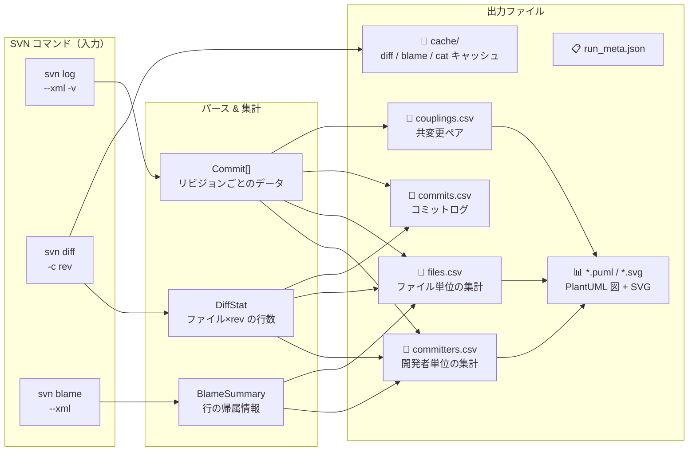

---

## 2. committers.csv — コミッター単位の指標

開発者（作者）ごとに、対象リビジョン範囲での活動を集計したファイルです。

### 2.1 基本的な活動量

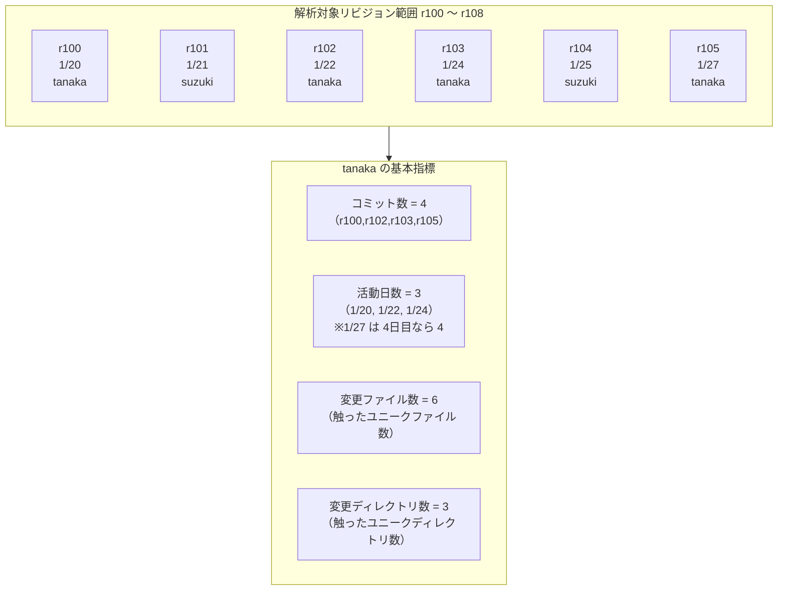

| 列名 | 意味 | 読み方 |
|---|---|---|
| **作者** | SVN のコミッターユーザー名 | — |
| **コミット数** | 対象範囲内のコミット回数 | 多いほど活動量が多い |
| **活動日数** | コミットした日数（重複除去） | コミット数 と比較すると1日あたりの密度が分かる |
| **変更ファイル数** | 変更したユニークファイル数 | 多いと広範囲に関与している |
| **変更ディレクトリ数** | 変更したユニークディレクトリ数 | 多いとプロジェクト横断的に活動している |

### 2.2 行数・チャーン（変更量）

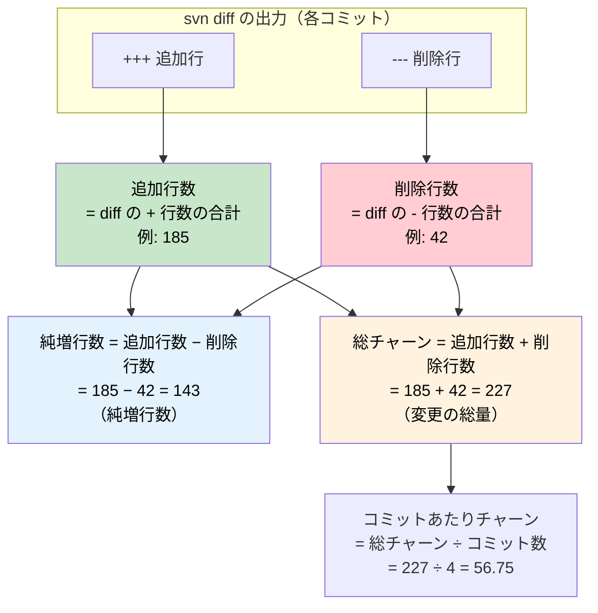

| 列名 | 意味 | 読み方 |
|---|---|---|
| **追加行数** | diff の + 行数の合計 | 純粋なコード追加量 |
| **削除行数** | diff の - 行数の合計 | リファクタ・修正の量 |
| **純増行数** | `追加行数 − 削除行数` | 正なら純増、負なら純減 |
| **総チャーン** | `追加行数 + 削除行数` | **変更の総量**。量の大きさそのもの |
| **コミットあたりチャーン** | `総チャーン ÷ コミット数` | 1コミットあたりの平均変更量。大きいと「1回で大量に変える」傾向 |

### 2.3 チャーン比（変更の傾向）

以下の図は、開発者 3 名の変更パターンを視覚的に比較したものです。
棒の長さが 追加行数 / 削除行数 を示し、その比率から傾向を読み取れます。

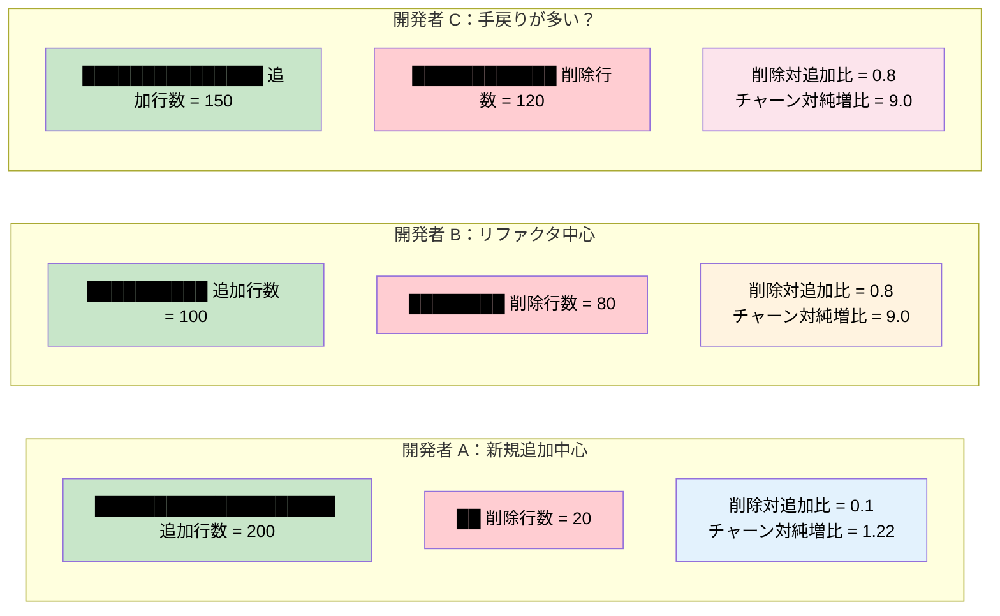

> **B と C は比率が同じ** ですが、文脈が異なります。B はリファクタ、C は仕様変更による手戻り…など、**比率だけでは善悪を判定できない** ことに注意してください。

| 列名 | 計算式 | 読み方 |
|---|---|---|
| **削除対追加比** | `削除行数 ÷ max(1, 追加行数)` | **1 に近い** → 追加と削除が同量（リファクタ的）。**0 に近い** → 新規追加中心 |
| **チャーン対純増比** | `総チャーン ÷ max(1, |純増行数|)` | **1 に近い** → ほぼ全てが純増 or 純減（効率的）。**大きい** → 追加と削除を繰り返している（手戻りの可能性） |

> **チャーン対純増比 の目安：**
> - 1.0〜2.0：通常の開発
> - 3.0 以上：やり直し・試行錯誤が多い可能性あり（ただし正当なリファクタでも上がる）

### 2.4 アクション回数

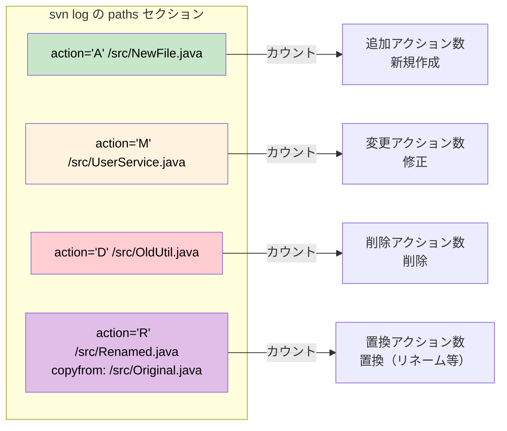

| 列名 | 意味 | 読み方 |
|---|---|---|
| **追加アクション数** | ファイル新規作成（A）の回数 | 新しい機能・モジュールの追加 |
| **変更アクション数** | ファイル修正（M）の回数 | 既存コードへの変更 |
| **削除アクション数** | ファイル削除（D）の回数 | 不要コードの整理 |
| **置換アクション数** | ファイル置換（R）の回数 | リネーム・移動（SVN の Replace 操作） |
| **バイナリ変更回数** | バイナリファイルの変更回数 | 画像・Excel 等の変更。行数には反映されない |

### 2.5 生存量・所有量（blame 系指標）

| 列名 | 意味 | 読み方 |
|---|---|---|
| **生存行数** | 対象範囲内で追加した行のうち、**ToRev 時点でまだ残っている行数** | **品質の直接的な指標**。「書いたコードが消されずに残った＝正しく必要だった」 |
| **消滅追加行数** | `追加行数 − 生存行数` | **手戻り量**。大きいと書いたコードの多くが最終的に不要になった |
| **所有行数** | ToRev 時点で blame がその Author を指す**全行数**（範囲外の過去分も含む） | **責任範囲の広さ**。多いとそのコードベースを実質的に「所有」している |
| **所有割合** | `所有行数 ÷ 全対象ファイルの合計行数` | **所有割合**。1人に偏ると知識集中リスク（バス係数低下） |

#### 💡 生存行数 と 所有行数 の違い

以下の図は、あるファイル（200行）の ToRev 時点の blame 結果を行ごとに色分けしたものです。

```mermaid
block-beta
    columns 1
    block:FILE["UserService.java（ToRev=r108 時点で 200 行）"]
        columns 5
        block:PAST["行 1〜80\n（r50 で tanaka が追加）\n\n解析範囲【外】"]:2
        end
        block:SURV["行 81〜175\n（r100〜r107 で tanaka が追加）\n\n解析範囲【内】"]:2
        end
        block:OTHER["行 176〜200\n（r101〜r108 で suzuki が追加）\n\n解析範囲【内】"]:1
        end
    end

    style PAST fill:#b0bec5,color:#000
    style SURV fill:#a5d6a7,color:#000
    style OTHER fill:#90caf9,color:#000
```

```
 tanaka の指標:
 ┌──────────────────────────────────────────────────────────────┐
 │ 生存行数 = 95                                            │
 │   → 範囲内(r100〜r107)で追加した行のうち ToRev で残った行数  │
 │   → 行 81〒175 の 95行のみが対象                            │
 │   → 品質指標（「書いたコードが定着したか」）                 │
 ├──────────────────────────────────────────────────────────────┤
 │ 所有行数 = 175                                          │
 │   → ToRev 時点で blame が tanaka を指す全行数                │
 │   → 行 1〜80（範囲外）＋ 行 81〜175（範囲内）= 175行        │
 │   → リスク指標（「どれだけの責任範囲を持つか」）             │
 └──────────────────────────────────────────────────────────────┘
```

| 指標 | 対象範囲 | 測れること |
|---|---|---|
| **生存行数** | **FromRev〜ToRev で追加した行**に限定 | 今回の期間の「成果の定着度」＝品質 |
| **所有行数** | **全期間の行**（範囲外の過去分も含む） | 最終状態での「責任範囲の広さ」＝リスク管理 |

**例：** ある開発者が過去（FromRev 以前）に 500 行書いており、今回の期間に 100 行追加して 80 行が残った場合：
- 生存行数 = 80（今回の追加行のうち残った分）
- 所有行数 = 580（過去 500 + 今回 80）

### 2.6 変更の分散

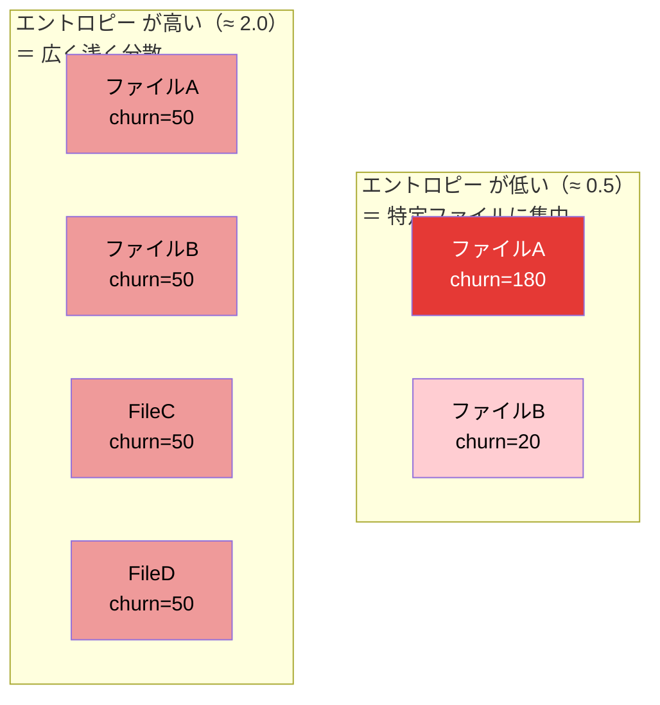

| 列名 | 意味 | 読み方 |
|---|---|---|
| **変更エントロピー** | ファイル別 churn のエントロピー（情報量） | **高い** → 広く浅く触る傾向。**低い** → 特定ファイルに集中 |

> エントロピーの計算：$E = -\sum p_i \log_2(p_i)$（$p_i$ = ファイル $i$ の churn が全体に占める割合）

### 2.7 協業指標

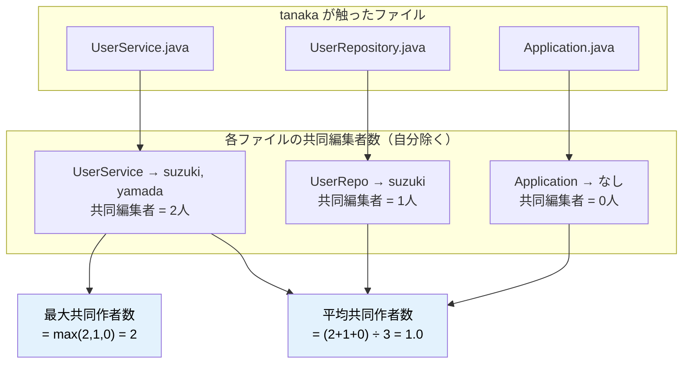

| 列名 | 意味 | 読み方 |
|---|---|---|
| **平均共同作者数** | 触ったファイルあたりの平均共同編集者数（自分除く） | 高いと協業が活発 |
| **最大共同作者数** | 同上の最大値 | 特定ファイルの密集度 |

### 2.8 コミットメッセージ指標

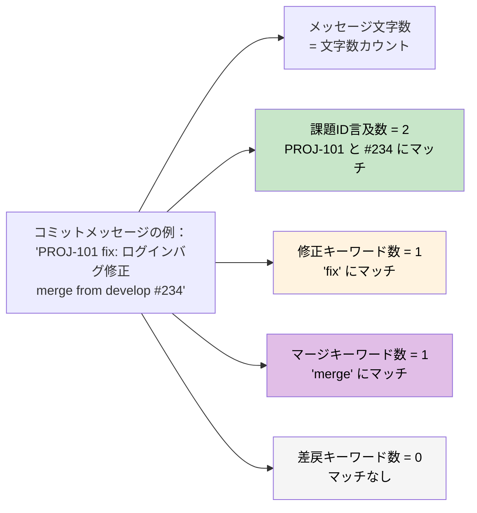

| 列名 | 意味 | 読み方 |
|---|---|---|
| **メッセージ総文字数** | 全コミットメッセージの合計文字数 | — |
| **メッセージ平均文字数** | 1コミットあたりの平均メッセージ文字数 | 極端に短いと「内容不明なコミット」の兆候 |
| **課題ID言及数** | `#123` や `PROJ-456` 等のチケット番号の出現回数 | トラッカー連携の運用状況 |
| **修正キーワード数** | `fix` / `bug` / `hotfix` 等の出現回数 | バグ修正の頻度 |
| **差戻キーワード数** | `revert` / `rollback` 等の出現回数 | 巻き戻し操作の頻度 |
| **マージキーワード数** | `merge` の出現回数 | マージ作業の頻度 |

> これらは**回数のみ**を提供し、「良い／悪い」の判定は行いません。

### 2.9 他者コード変更指標（blame 由来）

各コミットの blame 情報を前後比較し、**他人が書いた行を自分が削除・置換した規模**と、**その置換行が最終版に残ったか**を誤差ゼロで計測します。

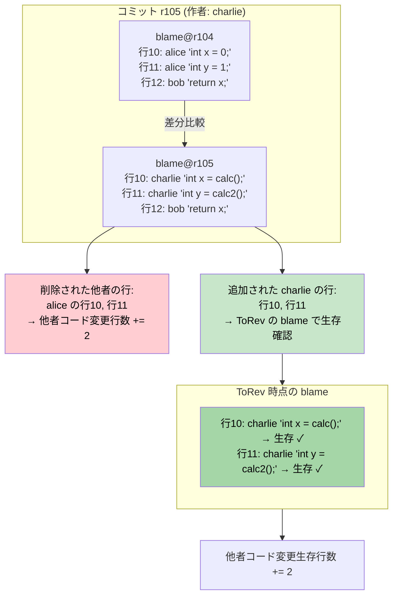

| 列名 | 意味 | 読み方 |
|---|---|---|
| **他者コード変更行数** | 他者が書いた行を自分が削除した行数（blame で原著者を厳密特定） | 大きいと他者のコードを積極的に修正している（レビュー・リファクタの指標） |
| **他者コード変更生存行数** | 他者コード変更コミットで自分が追加した行のうち ToRev 時点で生存している行数 | 大きいと他者コード修正の成果が定着している（修正品質の指標） |

> **アルゴリズム：**
> 1. 各コミットで `svn blame` の前後差分を取り、KilledLines（消えた行）の原著者が自分以外なら「他者コード変更行数」をカウント
> 2. その（リビジョン, 作者）ペアを記録し、ToRev 時点の最終 blame で該当ペアの行数を「他者コード変更生存行数」としてカウント
> 3. 全て blame の行単位で集計するため**誤差ゼロ**

---

## 3. files.csv — ファイル単位の指標

ファイルごとに「どれだけ変更されたか」「誰が責任を持っているか」を集計します。

### 3.1 基本指標

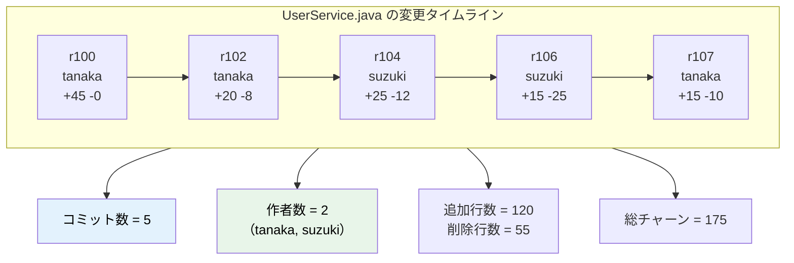

| 列名 | 意味 | 読み方 |
|---|---|---|
| **ファイルパス** | リポジトリルートからの相対パス | — |
| **コミット数** | そのファイルに変更があったコミット回数 | **多いと頻繁に手が入っている「ホット」なファイル** |
| **作者数** | 変更した開発者数（重複除去） | 1人だけ → 知識集中。多いほど知識が分散 |
| **追加行数 / 削除行数 / 純増行数 / 総チャーン** | committers.csv と同義（ファイル観点） | — |
| **バイナリ変更回数** | バイナリとして変更された回数 | — |

### 3.2 変更履歴

| 列名 | 意味 | 読み方 |
|---|---|---|
| **作成回数** | 新規作成（A）された回数 | 通常 0 か 1 |
| **削除回数** | 削除（D）された回数 | 1 以上は一度消えたことがある |
| **置換回数** | 置換（R）された回数 | リネーム・移動 |
| **初回変更リビジョン** | 範囲内で最初に変更されたリビジョン | — |
| **最終変更リビジョン** | 範囲内で最後に変更されたリビジョン | — |
| **平均変更間隔日数** | 変更間隔の平均日数 | **短いほど頻繁に触られる不安定なファイル** |

### 3.3 所有権・集中度

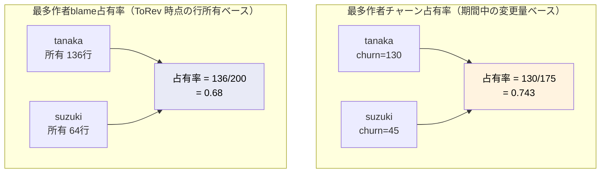

| 列名 | 意味 | 読み方 |
|---|---|---|
| **最多作者チャーン占有率** | Churn が最大の開発者のシェア | **1.0** → 1人だけが変更。**0.5** → 2人で半々 |
| **最多作者blame占有率** | ToRev 時点の blame で最大シェアの開発者の割合 | 1.0 に近い → 実質1人が全行を所有。**知識集中リスク** |

> **最多作者チャーン占有率 と 最多作者blame占有率 の違い：**
> - チャーン占有率：「期間中に最も多く変更した人」のシェア
> - blame占有率：「最終時点で最も多く行を所有している人」のシェア
> 
> チャーン占有率 が高いが blame占有率 が低い → 変更は多いが最終的な所有者は別の人（他者に修正された可能性）

### 3.4 生存量（ファイル側）

| 列名 | 意味 | 読み方 |
|---|---|---|
| **生存行数 (範囲指定)** | 範囲内リビジョンで追加され ToRev でまだ残っている行数 | — |
| **消滅追加行数** | `追加行数 − 生存行数 (範囲指定)` | 大きいとこのファイルで手戻りが多い |

### 3.5 ホットスポット

| 列名 | 計算式 | 読み方 |
|---|---|---|
| **ホットスポットスコア** | `コミット数² × 作者数 × 総チャーン ÷ max(活動期間日数, 1)` | **「頻繁に・多くの作者が・大量に変えるファイル」** ほどスコアが高い。短期間に集中した変更をより高く評価する |
| **ホットスポット順位** | ホットスポットスコア の降順ランキング | 1 が最も「ホット」なファイル |

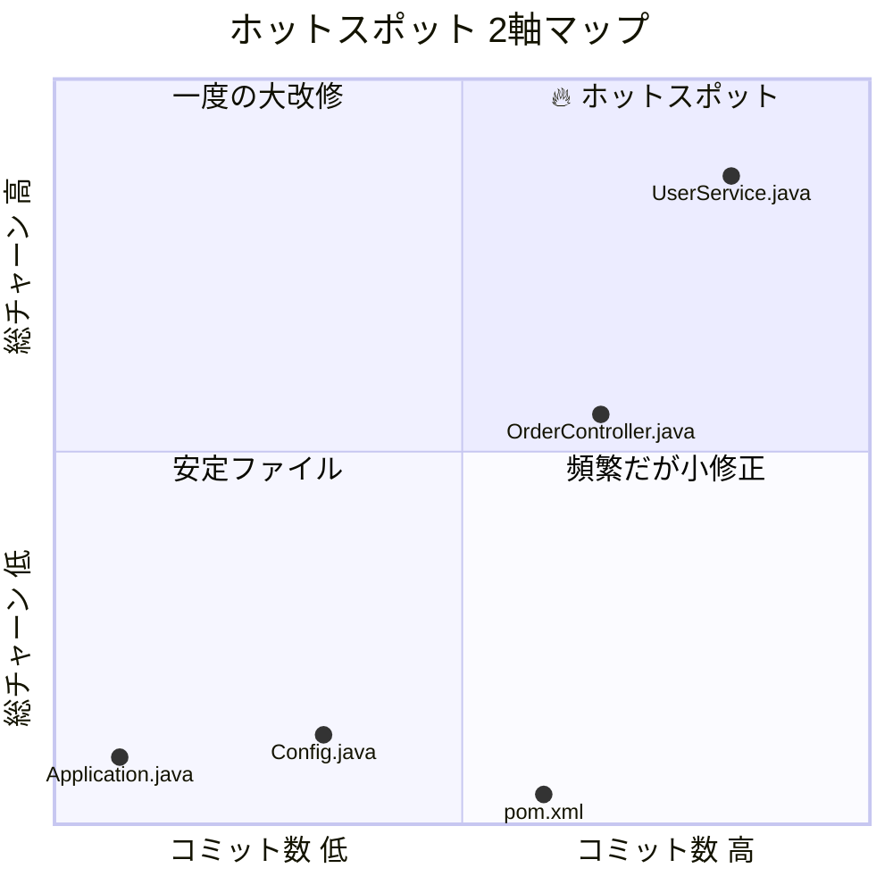

> **ホットスポットスコア の考え方：**
> - コミット数 だけ高く チャーン が小さい → 頻繁だが小修正（設定ファイルなど）
> - チャーン だけ高く コミット数 が少ない → 一度の大改修
> - **両方高い → 繰り返し大量の変更が入る「危険なファイル」**（右上の🔥領域）

---

## 4. commits.csv — コミット単位のログ

生のコミットログを整形した参照用データです。

| 列名 | 意味 | 読み方 |
|---|---|---|
| **リビジョン** | SVN リビジョン番号 | — |
| **日時** | コミット日時（ISO 8601 形式） | — |
| **作者** | コミッター名 | — |
| **メッセージ文字数** | コミットメッセージの文字数 | 0 や極端に短い → メッセージなしコミット |
| **メッセージ** | メッセージ（最大 140 文字で切り詰め） | — |
| **変更ファイル数** | 変更されたファイル数 | 極端に多い → 大規模リファクタ or マージコミット |
| **追加行数 / 削除行数** | 追加・削除行数 | — |
| **チャーン** | `追加行数 + 削除行数` | そのコミットの変更規模 |
| **エントロピー** | 1コミット内での変更の分散度 | 後述 |

### エントロピー（コミット内変更分散度）の読み方

各ファイルの churn を $c_i$ として：

$$E = -\sum \frac{c_i}{\sum c_i} \log_2 \frac{c_i}{\sum c_i}$$

```mermaid
flowchart LR
    subgraph E0["エントロピー = 0.0"]
        direction TB
        E0_A["ファイルA\nchurn=50"]
        E0_NOTE["1ファイルに集中"]
        style E0_A fill:#e53935,color:#fff
        style E0_NOTE fill:transparent,stroke:none,color:#666
    end

    subgraph E1["エントロピー ≈ 1.0"]
        direction TB
        E1_A["ファイルA\nchurn=25"]
        E1_B["ファイルB\nchurn=25"]
        E1_NOTE["2ファイルに均等"]
        style E1_A fill:#ef5350,color:#fff
        style E1_B fill:#ef5350,color:#fff
        style E1_NOTE fill:transparent,stroke:none,color:#666
    end

    subgraph E2["エントロピー ≈ 2.0"]
        direction TB
        E2_A["A\n12"]
        E2_B["B\n13"]
        E2_C["C\n12"]
        E2_D["D\n13"]
        E2_NOTE["4ファイルに均等"]
        style E2_A fill:#ef9a9a,color:#000
        style E2_B fill:#ef9a9a,color:#000
        style E2_C fill:#ef9a9a,color:#000
        style E2_D fill:#ef9a9a,color:#000
        style E2_NOTE fill:transparent,stroke:none,color:#666
    end

    E0 ~~~ E1 ~~~ E2
```

| エントロピー の値 | 解釈 |
|---|---|
| **0.0** | 1ファイルだけの変更（完全集中） |
| **1.0** | 2ファイルに均等な変更 |
| **2.0** | 4ファイルに均等な変更 |
| **3.0 以上** | 8ファイル以上に広く分散した変更 |

> エントロピー が高いコミットは「散発的な修正」か「横断的なリファクタ」の可能性があります。

---

## 5. couplings.csv — ファイル同時変更の関連度

「同じコミットで一緒に変わるファイル」のペアを集計します。

| 列名 | 意味 | 読み方 |
|---|---|---|
| **ファイルA / ファイルB** | ペアとなる2つのファイル | — |
| **共変更回数** | 同じコミットで両方が変更された回数 | 多いほど強い関連性 |
| **Jaccard** | 類似度係数 | — |
| **リフト値** | 相関度係数 | — |

### Jaccard 係数

$$J(A, B) = \frac{\text{共変更回数}}{\text{Count}(A) + \text{Count}(B) - \text{共変更回数}}$$

以下の図はベン図的に「コミットの集合」を示しています。重なり部分が 共変更回数 です。

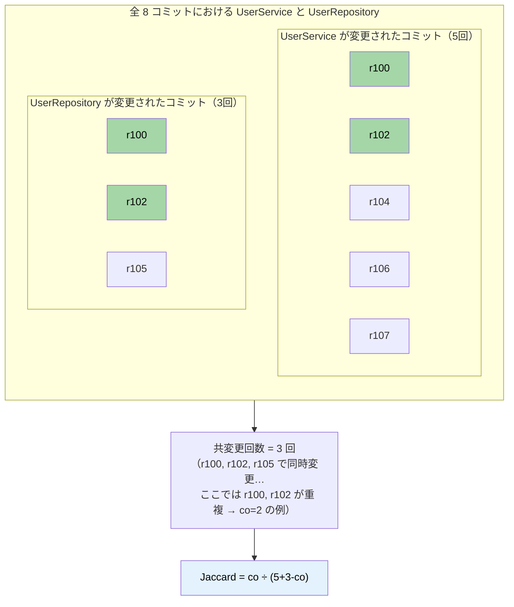

```
 Jaccard の直感的な理解：

  ファイルA のコミット集合       ファイルB のコミット集合
  ┌───────────────────┐    ┌───────────────────┐
  │ r100  r102  r104  │    │ r100  r102  r105  │
  │       r106  r107  │    │                   │
  └───────────────────┘    └───────────────────┘
             ↕ 重なり: r100, r102（co=2）

  Jaccard = 2 / (5 + 3 - 2) = 2/6 = 0.333
  → 約 33% の確率でセットで変わる
```

| 値 | 解釈 |
|---|---|
| **1.0** | 常に一緒に変わる（完全に連動） |
| **0.5** | 半分程度の確率で一緒に変わる |
| **0.1 以下** | たまたま一致しただけの可能性 |

> **Jaccard が高い = 密結合の兆候**。本来独立であるべきファイルが常にセットで変わっている場合は、設計の見直しが必要かもしれません。

### リフト値

$$L(A, B) = \frac{P(A \cap B)}{P(A) \times P(B)}$$

```
 リフト値 の直感的な理解：

 「もし A と B の変更が完全に独立（無関係）だったら、
   偶然同時に変わる確率はどれくらいか？」
   → P(A) × P(B)

 「実際に同時に変わった確率は？」
   → P(A∩B) = co / 全コミット数

 例：全 8 コミット中、A が 5 回、B が 3 回、同時が 3 回
   偶然の期待値 = (5/8) × (3/8) = 0.234
   実際の確率   = 3/8 = 0.375
   リフト値 = 0.375 / 0.234 = 1.6

   → 偶然より 1.6 倍も多く同時に変わっている！
     ┌─────────────────────────────────┐
     │  リフト値 < 1.0  → 偶然より少ない   │
     │  リフト値 = 1.0  → 偶然と同じ（無関連）│
     │  リフト値 > 1.0  → 偶然より多い 🚨   │
     └─────────────────────────────────┘
```

| 値 | 解釈 |
|---|---|
| **1.0** | 偶然と同じ確率で同時変更される（無相関） |
| **1.0 より大きい** | 偶然より高い頻度で同時変更される（**正の相関**） |
| **1.0 未満** | 偶然より低い頻度（負の相関。同時には変わりにくい） |

> リフト値 が高いペアは「片方を変えたらもう片方も変えなければいけない」関係で、結合度の高さを示唆します。

---

## 6. run_meta.json — 実行メタ情報

解析の再現性を担保するためのメタデータです。

| フィールド | 意味 |
|---|---|
| `StartTime` / `EndTime` | スクリプト実行の開始・終了時刻 |
| `DurationSeconds` | 実行時間（秒） |
| `RepoUrl` | 解析対象のリポジトリ URL |
| `FromRev` / `ToRev` | リビジョン範囲 |
| `StrictMode` | Strict モード（per-revision blame による厳密計算）の有無（常に `true`） |
| `CommitCount` / `FileCount` | 検出されたコミット数・ファイル数 |
| `Parameters` | 使用したフィルタ・オプション一覧（IgnoreWhitespace / ExcludeCommentOnlyLines 等） |
| `Outputs` | 出力されたファイル名の一覧 |

`Parameters.ExcludeCommentOnlyLines` が `true` の場合、コメント専用行（コードを含まない行）は全メトリクスから除外されます。  
判定は拡張子に応じた組み込みプロファイル（`CStyle` / `CSharpStyle` / `JsTsStyle` / `PowerShellStyle` / `IniStyle`）を使い、コメント記法と文字列リテラル境界を併用して行われます。

> **同じ条件で再実行したい場合**、このファイルを見ればパラメータを復元できます。

---

## 7. PlantUML / SVG ファイル

CSV の集計結果を元に、以下の PlantUML テキストと SVG 画像が自動生成されます。

| ファイル | 内容 | 形式 |
|---|---|---|
| `contributors_summary.puml` | コミッター Top N の指標表 | salt テーブル |
| `hotspots.puml` | ホットスポット Top N ファイルの表 | salt テーブル |
| `cochange_network.puml` | ファイル間の共変更ネットワーク | コンポーネント図 |
| `file_hotspot.svg` | ファイルのホットスポット散布図 | SVG |
| `file_quality_scatter.svg` | ファイル品質散布図 | SVG |
| `committer_outcome_*.svg` | 作者別の成果/差戻チャート | SVG |
| `committer_outcome_combined.svg` | チーム比較の成果/差戻チャート | SVG |
| `committer_scatter_*.svg` | 作者別のリワーク散布図 | SVG |
| `committer_scatter_combined.svg` | チーム比較のリワーク散布図 | SVG |
| `team_survived_share.svg` | チーム内の生存行数シェア | SVG |
| `team_interaction_heatmap.svg` | 作者間の削除関係ヒートマップ | SVG |
| `team_activity_profile.svg` | チーム活動プロファイル | SVG |
| `commit_timeline.svg` | コミット量の時系列 | SVG |
| `commit_scatter.svg` | コミット粒度の散布図 | SVG |
| `project_code_fate.svg` | コード運命チャート | SVG |
| `project_efficiency_quadrant.svg` | ファイル効率性四象限図 | SVG |
| `project_summary_dashboard.svg` | プロジェクトサマリダッシュボード | SVG |

---

## 8. cache/ — キャッシュディレクトリ

SVN コマンドの取得結果がリビジョン・ファイルごとに保存されます。

- **`diff_r{N}.txt`**: `svn diff -c {rev}` の生出力（Unified diff テキスト）
- **`blame/r{N}/{hash}.xml`**: `svn blame --xml` の XML 出力
- **`cat/r{N}/{hash}.txt`**: `svn cat` のテキスト出力

同一の `-OutDir` を指定して再実行すると、キャッシュが自動的に再利用され、SVN サーバーへのアクセスを省略できます。

> **注意:** diff キャッシュはフィルタ前の生データなので、`-IncludeExtensions` 等で絞っていても全ファイルの diff が含まれます。

---

## 9. 指標の組み合わせで見えること

単一の指標だけでなく、複数の指標を組み合わせると、より深い洞察が得られます。

### 判断フローチャート：何を見たいかに応じたガイド

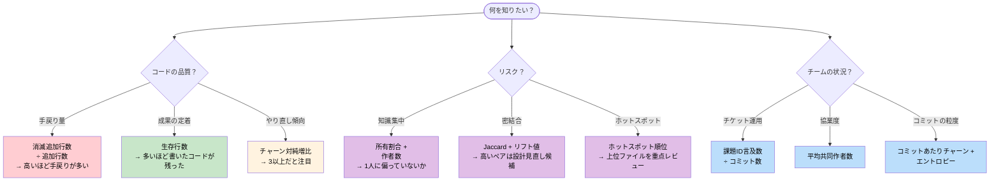

### 9.1 品質・手戻りの問題を発見する

| 見たい観点 | 組み合わせ | 判断基準 |
|---|---|---|
| 手戻りが多い開発者 | `消滅追加行数` ÷ `追加行数` | 比率が高いほど書いたコードが残っていない |
| やり直しの傾向 | `チャーン対純増比` が高い + `消滅追加行数` が高い | 両方高いと手戻りが頻発している |
| 1人に修正される人 | `追加行数` が多い + `生存行数` が少ない | 書いたが残らない → 他者に修正されている可能性 |

### 9.2 リスク（知識集中・密結合）を発見する

| 見たい観点 | 組み合わせ | 判断基準 |
|---|---|---|
| バス係数が低いファイル | `作者数 = 1` + `コミット数` が高い | よく変わるのに1人しか知らない |
| 知識集中の人 | `所有割合` が高い（例: 0.7以上） | コードの大半を1人が所有 |
| 密結合ファイル | `Jaccard` が高い + `共変更回数` が高い | 常にセットで変えざるを得ない → 分離を検討 |

### 9.3 ホットスポット（問題のありそうなファイル）

| 見たい観点 | 組み合わせ | 判断基準 |
|---|---|---|
| 最優先で調査すべきファイル | `ホットスポット順位` 上位 + `作者数 = 1` | 頻繁に大量変更される上に1人しか触っていない |
| 不安定なファイル | `平均変更間隔日数` が短い + `総チャーン` が大きい | 短期間で何度も大きく書き換わっている |

### 9.4 協業・チームの状況

| 見たい観点 | 指標 | 判断基準 |
|---|---|---|
| チケット運用の定着度 | `課題ID言及数` ÷ `コミット数` | 比率が低いとチケットなしで作業している |
| コミットメッセージの質 | `メッセージ平均文字数` | 極端に短い（10文字以下等）と意図が不明なコミット |
| マージ作業の負荷 | `マージキーワード数` が多い + `チャーン` が多い | マージに伴う大量変更の負担 |

---

## 10. よくある疑問（FAQ）

### Q. 数値が高い（低い）と「悪い」のですか？

**いいえ。** NarutoCode は「閾値による良し悪しの判定」を意図的に行いません。すべての指標は**カウント・数値の提示のみ**です。

例えば `チャーン対純増比` が高い場合でも：
- 大規模リファクタリングの最中なら正常
- 仕様が二転三転しているなら問題

文脈を踏まえて人間が判断する材料を提供するのがこのツールの役割です。

### Q. blame 解析には時間がかかりますか？

blame はファイル数 × リビジョン数分の SVN アクセスが発生するため、大規模リポジトリでは時間がかかります。ただし `-Parallel` で並列化され、キャッシュ（`cache/blame/`）により再実行は高速化されます。

### Q. バイナリ変更回数 は何を反映していますか？

バイナリファイル（画像・PDF・Excel 等）の変更は行数としてカウントできないため、`追加行数` / `削除行数` には含まれません。代わりに `バイナリ変更回数` で「バイナリファイルを何回変更したか」を別途記録しています。

### Q. コミットで 100 ファイル以上変わっている場合、couplings は正確ですか？

ファイル数にかかわらず、すべてのコミットが couplings 集計に含まれます。大規模コミットではペア数が $C(n, 2)$ で増加しますが、データの欠落を防ぐためフィルタリングは行いません。大規模マージやブランチ統合コミットの影響が気になる場合は、`-ExcludePaths` でパスを絞るか、出力 CSV を後処理してください。

### Q. エントロピー が 0 のコミットは何ですか？

1 ファイルだけを変更したコミットです。変更の分散が全くないため、エントロピーは 0 になります。

---

*このドキュメントは NarutoCode の現行実装に基づいています。*
